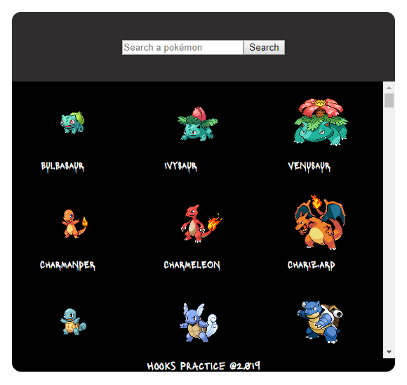

## Pokedex.

This is a pokedex built with React leveraging basic hooks functionality and the pokémon api,
for the ui i used flexbox for positioning elements and styled components to give it some 
color.

In addition components lazy load was added through lazy and suspense.

You can see a list of the 151 pokémons available in the api and search any, there's a detail
component where you can see a picture of the pokémon and relevant stats like type and base
experience.

Below you can see a screenshot of the end result:

<p align="center">
  
</p>

## How to run it ?

First step, clone the repo.

```console
foo@bar:~$ git clone https://github.com/wwleak/pokedex.git
```

Then run the following command within the project folder to install all the dependecies:

```console
foo@bar:~$ npm install
```

Afterwards run the following command:

```console
foo@bar:~$ npm run start
```

Now if you go on localhost://3000 you should see it.

Enjoy!

## Available Scripts

You can find all available scripts in the package.json file

## Note

It was solely a practice to start learning hooks stuff, if you have some suggestion, enhancement or 
comment, just let me now. I'm looking forward to add new functionality and try to use the rest of hooks and even create my own 
as i learn.


