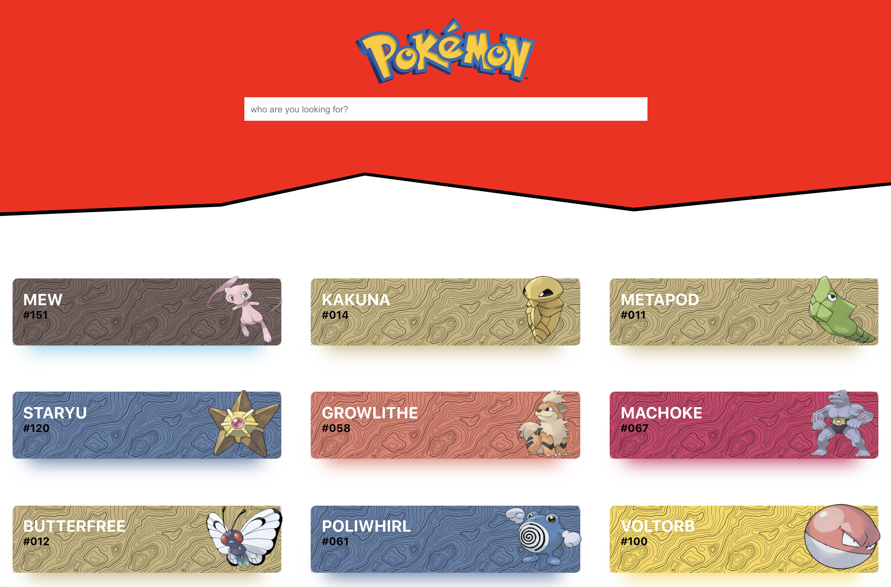

## Pokedex.

This is a pokedex built with react leveraging basic hooks functionality and the pokémon api,
for the ui I used flexbox for positioning elements and styled components to add it some 
styling.

You can see a list of the 151 pokémons available in the api and search any, when you click on a
card it flips so that you can see its back face.

Below you can see a screenshot of the end result:

<p align="center">
  
</p>

<table border="0" cellspacing="0" cellpadding="0" style="border-collapse: collapse; border: none;">
  <tr>
    <td></td>
    <td></td>
    <td></td>
    <td></td>
    <td></td>
  </tr>
</table>

Or if you wanna check it out live I deployed it to github pages --> [here](https://eiberham.github.io/pokedex/#/)

## How to run it locally ?

First step, clone the repo.

```console
foo@bar:~$ git clone https://github.com/eiberham/pokedex.git
```

Then run the following command within the project folder to install all the dependecies:

```console
foo@bar:~$ yarn install
```

Afterwards run the following command:

```console
foo@bar:~$ yarn run start
```

Now if you go on http://127.0.0.1:8084/#/ you'll see it.

Enjoy!


